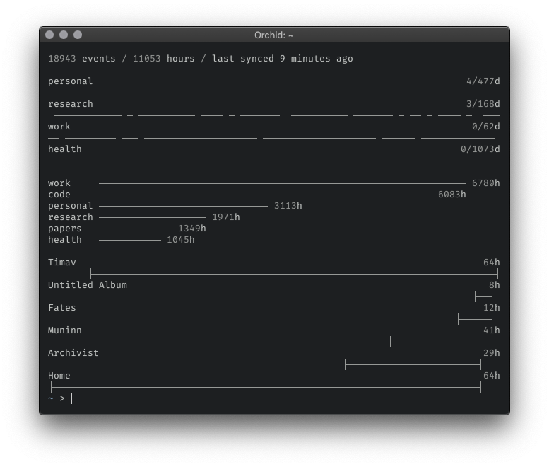

# timav

timav is a cli tool and a library for working with time tracking data kept in google calendar. For historical reference check out [timav blog post](https://szymonkaliski.com/log/2017-04-30-time-tracking/).

<p align="center"></p>

This is personal software project, shared mainly as a reference point. I wont be fixing bugs that don't happen to me, or add functionalities I don't want/need.

## Tracking

The system for describing logs looks like this:

```
[Project] @tag1 @tag2(subtag)
```

- `Project` is optional, and allows me to group logs for given project, it's usually a client project I work on, or well-defined personal project
- `@tag` is additional metadata that I can use to analyse the logs, I can add how many tags I want to a given event, but it's usually just a few; at the moment most often used ones are: `@work`, `@personal`, `@code(...)`
- `@tag(subtag)` is a shorthand for having more data about a given tag, but allows me to still nest them under one bigger thing, this might be overly complex, but works for me &mdash; I use `@code(js)` when I'm writing JavaScript, `@code(clj)` for Clojure, `@health(gym)` for when I'm training and `@health(walk)` when strolling

## Installation

1. `npm install -g timav-cli`
2. `timav config`, and set:

```json
{
  "calendar": "Tracking" // the name of google calendar with tracking data
}
```

3. `DEBUG=* timav cache` - first time should be run in interactive bash session, as it will lead you through the setup process
4. ideally add `timav cache` as a cronjob - I run it every 15 minutes

## Usage

- `timav cache` - download/update cached events
- `timav stats` - basic statistics
- `timav tags` - top-used tags
  - `timav tags -n 2` - specify how many tags to display
- `timav habit <query>` - show habit-like chart for specified query, for example: `timav habit @personal`
- `timav projects [query]` - show last projects, `query` is optional
  - `timav projects @work -n 2` - show last two work projects

## Library

In addition, `timav-cli` can be used as a library, example dashboard code used for the screenshot at the top of this file:

```js
#!/usr/bin/env node

const habit = require("timav-cli/habit");
const projects = require("timav-cli/projects");
const stats = require("timav-cli/stats");
const tags = require("timav-cli/tags");
const { getParsedEvents } = require("timav-cli/utils/paths");
const { loadConfig } = require("timav-cli/utils/config");

const { calendar } = loadConfig();
const events = getParsedEvents({ calendar });

let result = "";

// basic stats
result += stats.render(stats.calculate({ events, calendar }));
result += "\n\n";

// my habits
result += ["@personal", "@research", "@work", "@health"]
  .map(query => habit.render(habit.calculate({ events, query })))
  .join("\n");

// top 6 tags
result += "\n\n";
result += tags.render(tags.calculate({ events, calendar, n: 6 }));

// last 6 personal projects
result += "\n\n";
result += projects.render(projects.calculate({ events, calendar, query: "@personal", n: 6 }));

console.log(result);
```

